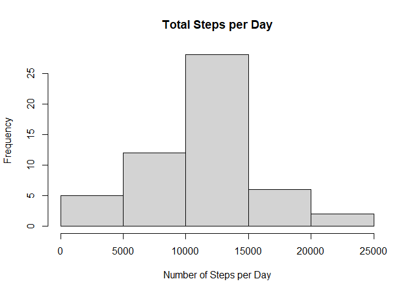

For this assignment, we will analyze data from a personal activity tracker. 

**1. Load the data.**


```r
activity <- read.csv(unzip("activity.zip"))  
```
  

**2. What is mean total number of steps taken per day?**

First we calculate the total steps per day and display the results in a histogram.

```r
dailysteps <- aggregate(steps~date,data=activity,FUN=sum)
hist(dailysteps$steps, xlab="Number of Steps per Day", main="Total Steps per Day")
```

<!-- -->

Next we calculate the mean and median steps per day.

```r
meansteps <- mean(dailysteps$steps, na.rm=TRUE)
mediansteps <- median(dailysteps$steps, na.rm=TRUE)
```

```r
meansteps
```

```
## [1] 10766.19
```

```r
mediansteps
```

```
## [1] 10765
```


**3. What is the average daily activity pattern?**

Calculate the average of each interval across days and plot the time series.

```r
mean.interval <- aggregate(steps~interval,data=activity,FUN=mean, na.rm=TRUE)
plot(mean.interval$interval,mean.interval$steps,type="l",
  main="Average Daily Activity", xlab="Time of Day", ylab="Steps")
```

<!-- -->

Find the interval which contains the maximum number of daily steps.

```r
max.interval <- mean.interval[max(mean.interval$steps),]
max.interval
```

```
##     interval    steps
## 206     1705 56.30189
```

The interval with the maximum daily steps is 1705.  

**4. Impute missing values.**

First calculate the total number of missing values in the data set

```r
sum(is.na(activity$steps))
```

```
## [1] 2304
```

Next create a new data set by replacing each missing value with the mean value of the interval

```r
rmna <- activity
for(i in 1:nrow(rmna)){
if(is.na(rmna[i,]$steps))
  rmna[i,]$steps <- mean.interval[rmna[i,]$interval==mean.interval$interval,]$steps
}
```

Using this imputed data, create a histogram of the total daily steps.

```r
new.dailysteps <- aggregate(steps~date,data=rmna,FUN=sum)
hist(new.dailysteps$steps, xlab="Number of Steps per Day", 
  main="Total Steps per Day (imputed NA's)")
```

<!-- -->
  
Calculate the mean and median of the data set with imputed values.

```r
new.meansteps <- mean(new.dailysteps$steps)
new.mediansteps <- median(new.dailysteps$steps)
```
Mean steps with imputed values:

```r
new.meansteps
```

```
## [1] 10766.19
```

Median steps with imputed values:

```r
new.mediansteps
```

```
## [1] 10766.19
```
There is not much change to the mean and median after filling in the missing data.  


**5. Are there differences in activity patterns between weekdays and weekends?**

First split the data by weekend and weekday

```r
rmna$day <- weekdays(as.Date(rmna$date))
week.end <- rmna[rmna$day %in% c("Sunday","Saturday"),]
week.day <- rmna[!rmna$day %in% c("Sunday","Saturday"),]
```

Then calculate the average steps for each interval across all days

```r
week.end.interval <- aggregate(steps~interval,data=week.end,FUN=mean)
week.day.interval <- aggregate(steps~interval,data=week.day,FUN=mean)
```

Format a data frame with the factor variable indicating "weekend" or "weekday"

```r
mean.activity <- rbind(week.end.interval,week.day.interval)

names <- c(rep("weekend",nrow(week.end.interval)),
  rep("weekday",nrow(week.day.interval)))
  
weekday.df <- data.frame(mean.activity,names)
```

Create a panel plot to compare average activity on weekends and weekdays

```r
library(ggplot2)
g <- ggplot(weekday.df,aes(interval,steps))
g + geom_line()+ facet_grid(names~.) + labs(title="Average activity: Weekend vs Weekday")
```

<!-- -->

